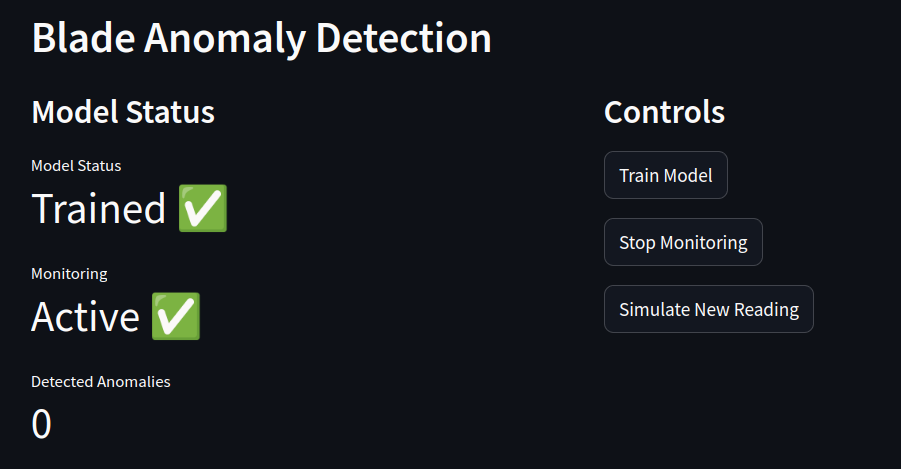

# Value Stream Mapping for OEM Manufacturing Processes

## Setup
1. `pip install -r requirements.txt`
2. pull the data folder from this google drive [link](https://drive.google.com/drive/folders/1YsQ9CVeBzHO25k5KPyK3jlJHNcrcvTWw?usp=sharing) and place it in ./datasets
3. pull the remaining fours file from this [link](https://drive.google.com/drive/folders/1cfuLauPM2b7B9ZicGXLe3I7m3gyVpQ9y?usp=sharing) and place them in ./models/
4. run `streamlit run main.py` for hoting a local server
5. a sample deployment can be found at : <coming soon>
## Methodology
Presentation Link: [here](https://docs.google.com/presentation/d/1SRCv6emTgD0ne2EPWP1wZErUS6NdeUES/edit?usp=sharing&ouid=100852616448167547034&rtpof=true&sd=true)
### OEM Models
- We use a dynamic approach towards adding individual and mutually dependent projects simulating a manufacturing process. 
- The robots and processes base classes can be extended to add more complex processes and robots. This will be made available to the frontend in the future.
- We have currently defined three robot types with varying specifications and characteristics.

### Value Stream Mapping
- Each Robot has several parameters and characteristic values attached to it that can be modified by the process to an extent depending on the load of the particular process.
- The process is a simple linear function that can be modified to a more complex function in the future.
### Predictive Maintenance & Anamoly Detection
- We train a VAE model based on the anomaly dataset provided by the [IMPROVE](https://www.improve-etn.eu/) project.
- The Jupyter Notebooks with EDA and model training can be found in the models folder.
- We provide separate controls for training the model and performing a live anomaly detection for the blade anomaly dataset.
- Similarly, we can extend this to other datasets and models in the future.

